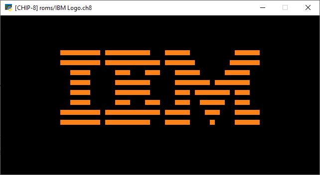

# Chip-8 in Python

## Requirements
* Python (2 or 3)
* pyglet

## TODO
* Not all opcodes are implemented, some aren't implemented properly.
* Input is not handled
* Visualize stack, memory in separate window
* Load from menu, rather than just through CLI.

Despite the TODO, it does display GFX. Included is a `ch8` file displaying the IBM logo.

References:
* http://www.multigesture.net/articles/how-to-write-an-emulator-chip-8-interpreter/
* https://en.wikipedia.org/wiki/CHIP-8#Virtual_machine_description
